---
{
  "Tags": 
  [
    "Git"
    , "Git-Flow"
    , "Visual Studio Code"
    , "VS Code"
    , "Beyond Compare"
  ]
  , "Date": "2020-12-21"  
  , "Author": "Bruce Lackore, Lead Engineer, Arizona Office of the Courts  "
  , "Software Versions":
    [
      "Git version 2.29.2.3"
      , "Beyond Compare 4.3.7, Build 25118"
    ] 
}
---

### Install, configure and perform basic activities using Git:

 1. Install Git for Windows 10  

 2. Configure Git for Windows 10  

 3. Create aliases for commonly used Git commands  

 4. Optionally configure Git to use Beyond Compare as a Diff/merge tool  

</b>

  
Definitions

Version Control System.
  * Centralized
  * Distributed  

  
Goals

  
Requirements

  
Presumptions

  
Software Needed

The following software should be obtained prior to beginning the installation  
and configuration process:  

   * [Git][Git-Url]
   * [Visual Studio Code][VisualStudioCode-Url]
   * [Visual Studio Code Insiders][VisualStudioCodeInsiders-Url]
   * [(Optional) Beyond Compare Diff/Merge tool][BeyondCompare-Url]

  
Installation walk-through

When you begin your installation of Git, you will be presented with an  
installation wizard. The following images are a _suggestion_ as to how to  
configure Git, one may choose other options, of course. But, these worked  
just fine for the author, and they allow code to be written in say "Windows"  
and then extracted and compiled in Linux because of the line-ending selection.  

The first page is the inevitable license page. Just hit "Next".

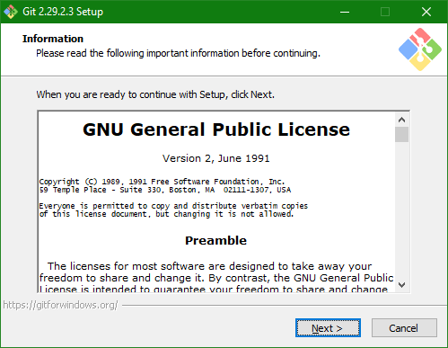  

Select the destination folder into which Git will be installed. Accepting the  
default is fine for this page.  

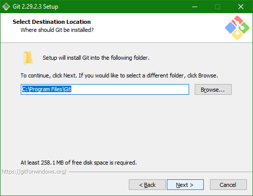  

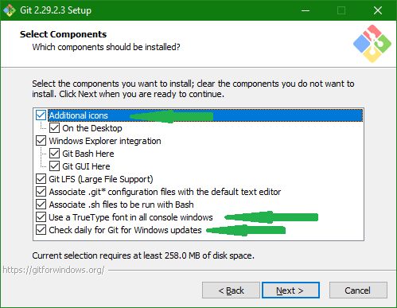  

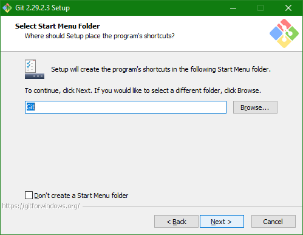  

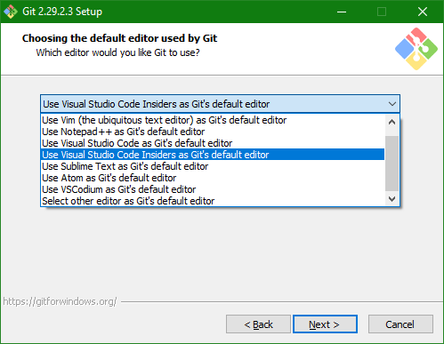  

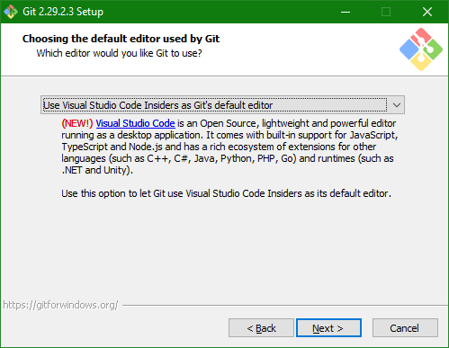  

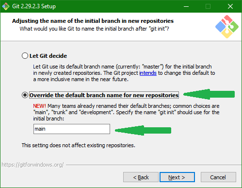  

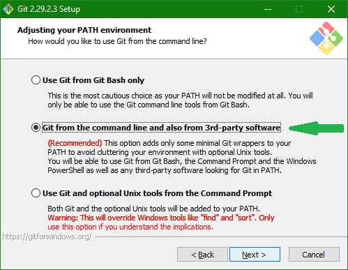  

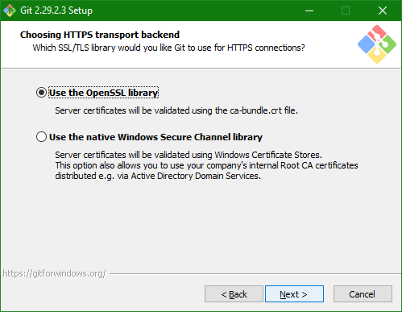  

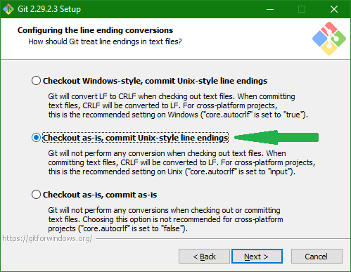  

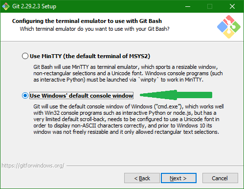  

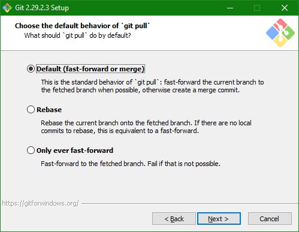  

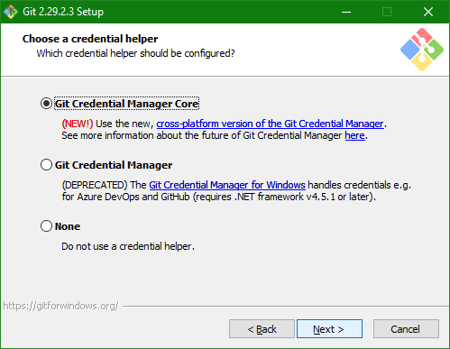  

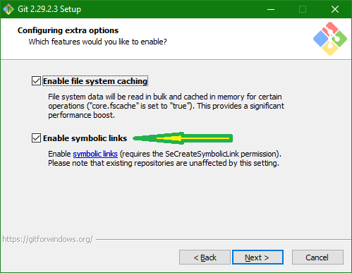  

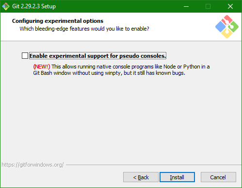  

### Post-Installation  

  
(Optional) Configure Git to use Beyond Compare 4 for Diff/Merge

##### Configure Beyond Compare 4 as a Diff (difference) tool  

Beyond Compare (BC) is a fabulous (in this authors' opinion) differencing and  
merge tool. It's inexpensive and works on just about anything (binary files,  
text, etc.)  
If the user decides to use BC for such purposes, below explains how to  
configure git to use BC as the preferred difference/merge tool.  
Perform this activity wherever BC is installed to ensure consistent operation.  

  * git config --global diff.tool bc  
  * git config --global difftool.bc.path "C:\Program Files\Beyond Compare 4\BCompare.exe"  
    * Ensure that the path is to your copy of BC.  
    * Ensure that, if there are spaces in the path, that the path is enclosed  
      in double quotes (").

##### To use BC as a difference tool

  * git difftool --dir-diff
    * This will compare the difference between the working directory and the  
      last fetch/pull.

##### Configure Beyond Compare as a Merge tool

  * git config --global merge.tool bc  
  * git config --global mergetool.bc.path "C:\Program Files\Beyond Compare 4\BCompare.exe"  

##### To use BC as a 3-way merge tool

  * git mergetool \<Some File Name\>

Gits default setting retain merge files with *.orig extensions after a  
successful merge. TO disable this **_safety_** feature and automatically  
delete *.orig files after a merge, execute:

  * git config --global mergetool.keepBackup false

If you are presented with a prompt, e.g. "Launch 'bc4' [Y/n]?" when performing  
a diff and you do not wish to see said prompt, execute the following

  * git config --global difftool.prompt false  

and the prompt should not longer be displayed.  

  

### Resources

  
Articles

[Setting up Git](https://git-scm.com/book/en/v2/Getting-Started-First-Time-Git-Setup)

  
Software

[Git][Git-Url]  
[Visual Studio Code][VisualStudioCode-Url]  
[Visual Studio Code Insiders][VisualStudioCodeInsiders-Url]  
[(Optional) Beyond Compare Diff/Merge Tool][BeyondCompare-Url]

[Git-Url]: https://git-scm.com/downloads  
[VisualStudioCode-Url]: https://code.visualstudio.com/Download
[VisualStudioCodeInsiders-Url]: https://code.visualstudio.com/insiders/
[BeyondCompare-Url]: https://www.scootersoftware.com/download.php  

